# Ads Client — current architecture and the v2 direction

**Status:** discussion document, for team alignment. Nothing here is committed to yet.
**Scope:** services, components and boundaries. No code, no type signatures, no schemas.

---

## The one-sentence version

Today the ads client is a **stateless HTTP SDK**: the consumer asks a question, we make a
request, we hand back a response. V2 makes it a **stateful ads client**: the consumer
*dispatches intent* and *queries a local read model*, and everything in between —
fetching, renewing, capping, selecting, reporting — is the SDK's problem.

The consumer experience we are aiming for is Sentry-shaped: **start it once, query it when
you need an ad, and stop thinking about it.** No cache tuning, no error handling, no
deciding when an impression happened.

| | Today | V2 |
| --- | --- | --- |
| Shape | request → response | dispatch → query |
| State | none survives a call | ads store, cap counters, outbox |
| Threading | caller's thread | one worker thread inside the SDK |
| Failure | thrown across the FFI | telemetry; `query()` returns nothing |
| Logic | HTTP, serialization, callback URLs | all ads business logic |

---

## 1. Current state

### 1.1 Component view

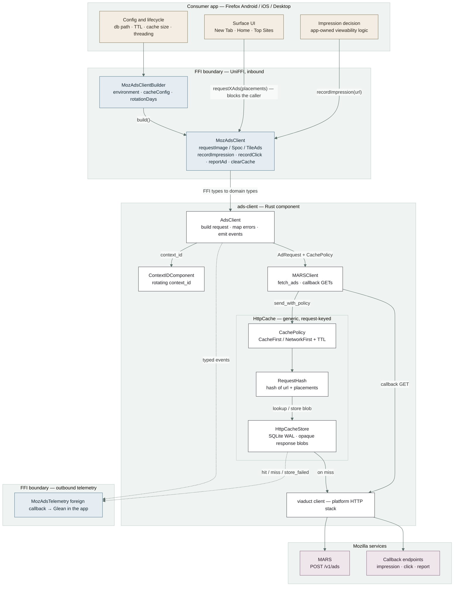

Three boundaries, one direction of travel. Note what the cache actually is: a **generic
HTTP response cache** keyed on a hash of *(url, placements)*, storing opaque response
blobs. It cannot reason about a single ad — only replay a whole response.

### 1.2 What happens on one request

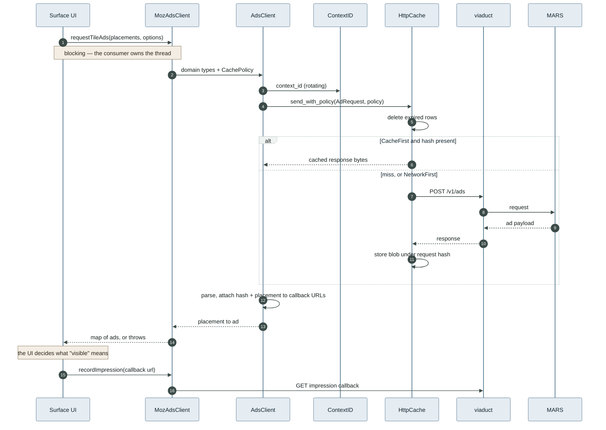

The whole component lives inside one blocking call. **Nothing survives the return:** not
what was served, not what was seen, not what caps were consumed — so nothing can inform
the next request.

### 1.3 Who owns what today

| Concern | Owner |
| --- | --- |
| When to request ads | Consumer |
| Threading, not blocking the UI | Consumer |
| Retry, backoff, offline behaviour | Nobody |
| Error handling and fallback UI | Consumer |
| What counts as an impression | Consumer |
| Frequency capping, rotation, pacing | Nobody — `caps` arrive on spocs and are unused |
| Cache lifetime, size, DB path | Consumer, via the builder |
| Which ad shows where | MARS, per request |
| HTTP, serialization, callback URLs | **SDK** |

The SDK owns the bottom row and nothing above it. That gap is what v2 closes, and it is
also why every surface currently reimplements the same ads logic slightly differently.

### 1.4 Four properties worth naming before we change them

- **The cache is an HTTP cache, not an ads cache.** Key: request hash. Value: response bytes.
- **`context_id` is deliberately excluded from the cache key**, so identity rotation does not
  invalidate cached responses. Correct for a response cache; an open question once we store
  ads individually.
- **Everything is synchronous.** No thread, no queue, no scheduler. Every call returns or
  throws, on the caller's thread.
- **Callbacks are fire-and-forget.** An impression is a blocking GET with no retry and no
  durability. If it fails, it is lost.

---

## 2. The change of shape

This is not "add a better cache". One request/response path splits into an independent
**write path** and **read path**, joined by a store that a background worker keeps warm.

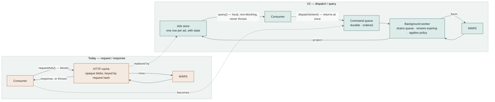

The store holds **ads**, not **responses**. Once an ad is a row with its own lifecycle —
fetched at, expires at, times shown, cap key, placement, block key — renewal, capping,
rotation and history-informed selection all become queries over local state instead of
new round trips.

---

## 3. V2 target architecture

### 3.1 The map

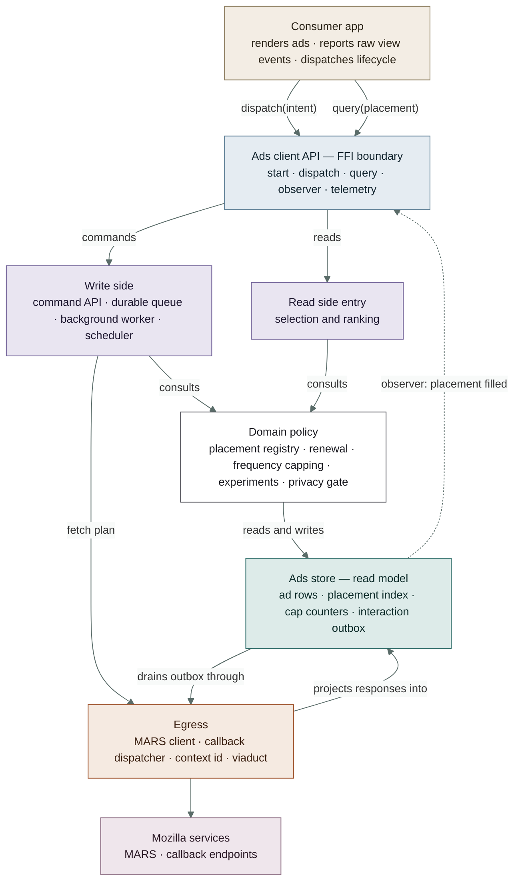

The three paths through this map are drawn separately below, because the whole point of
the change is that they are independent.

### 3.2 Write path — dispatch

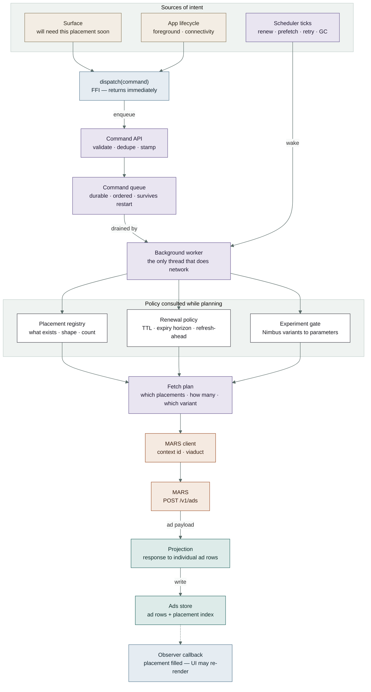

Two things enter this path: consumer intent, and the worker's own schedule. They meet at
the same queue, so a renewal and a prefetch are handled by identical machinery.

### 3.3 Read path — query

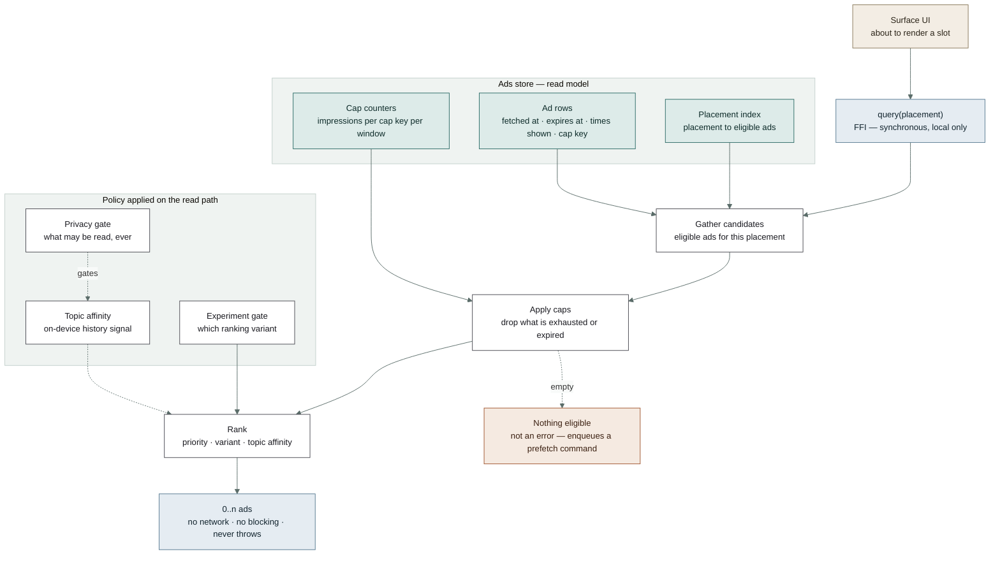

> **The read path is the contract.** `query()` never touches the network, never blocks,
> and never throws. It reads the store and returns whatever is eligible — possibly nothing.
> A miss is not an error; it is a signal to the worker that this placement needs filling.
> That is what makes the API Sentry-shaped: errors become telemetry, not consumer control flow.

### 3.4 Interaction path — impressions, clicks, reports

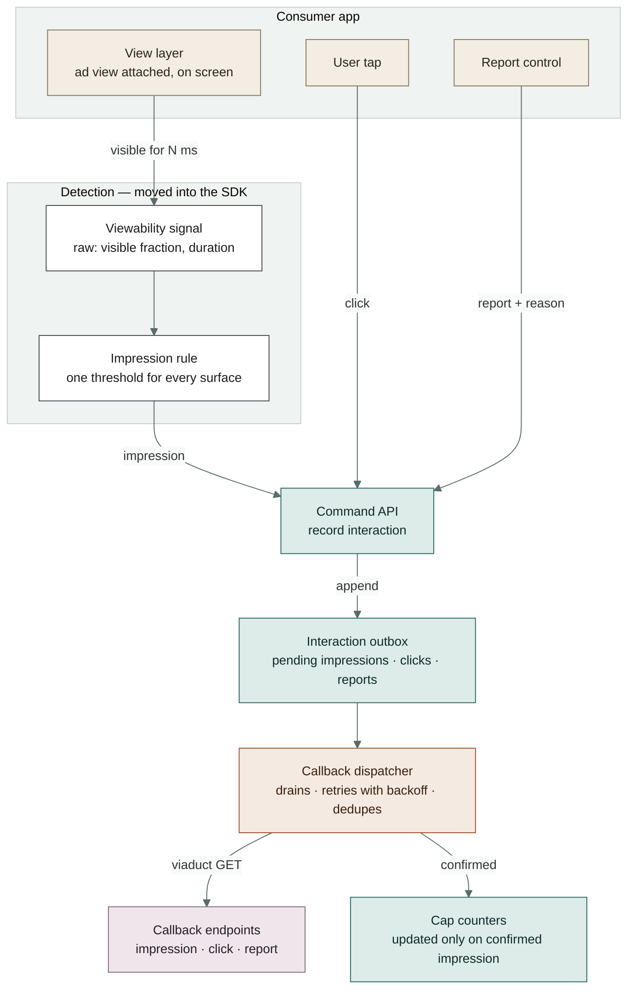

The consumer stops declaring impressions and starts reporting raw visibility. The
threshold moves inside, which is what makes cap counters comparable across surfaces.

### 3.5 Block responsibilities

| Block | Owns | Explicitly does **not** own |
| --- | --- | --- |
| Command API | Validating and deduping intent; turning a call into a durable command | Any network work inline |
| Command queue | Durability and ordering; surviving process death | Deciding *when* work runs |
| Background worker | The only thread that talks to the network; draining the queue; scheduled ticks | Business rules — it asks the domain services |
| Placement registry | What placements exist, their shape and count | Fetching |
| Renewal policy | What is stale, what expires soon, when to refresh ahead of expiry | Fetching |
| Frequency capping | Counting impressions per cap key and window; declaring an ad ineligible | Deciding what a view *is* |
| Selection and ranking | "Best stored ad for this placement, now" | Fetching, or any network on the read path |
| Experiment gate | Resolving Nimbus variants into policy parameters | Enrolment — Nimbus owns that |
| Privacy gate | The hard boundary on which local signals may be read, and what may leave the device | Being optional |
| Ads store | Ad rows and their state; placement index; cap counters | Being a general HTTP cache |
| Interaction outbox | Durable, retried, deduped delivery of impressions, clicks and reports | Deciding when an impression occurred |
| Callback dispatcher | Draining the outbox with backoff | Being called synchronously by the UI |
| MARS client | Request shape, context id, response parsing | Deciding when to fetch |

---

## 4. The life of one ad

Renewal and capping are only expressible because a stored ad has states. This is the
mechanism the HTTP cache cannot represent: a blob is either present or expired, full stop.

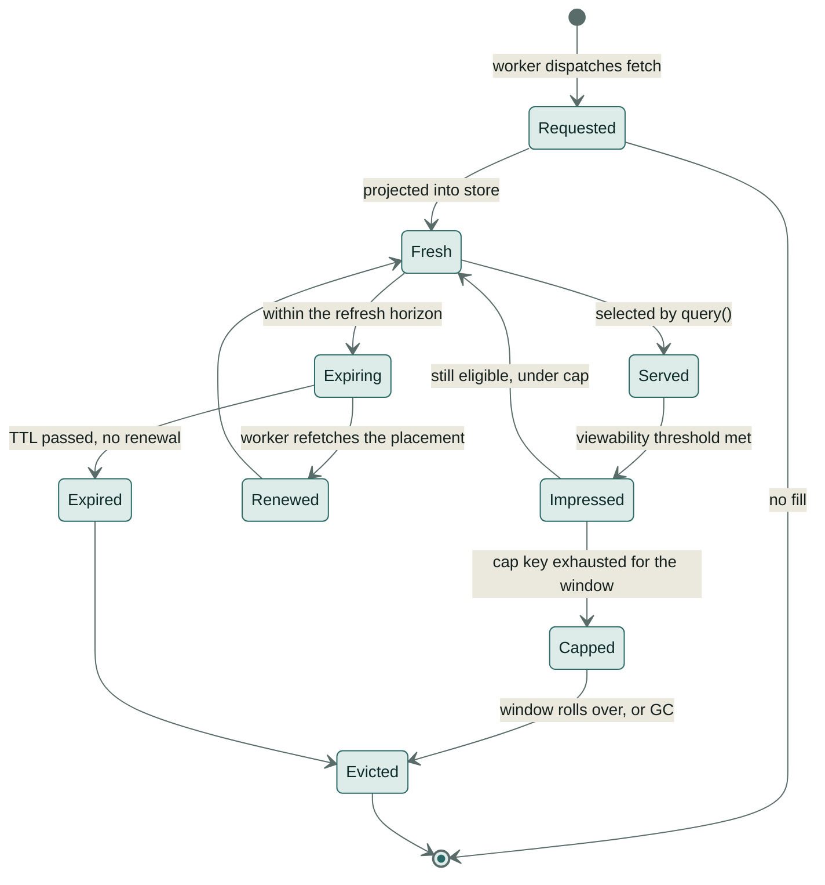

`Expiring → Renewed` is the auto-renew loop; `Impressed → Capped` is frequency capping.
Both are the worker acting on store state, with no consumer involvement.

---

## 5. A session, end to end

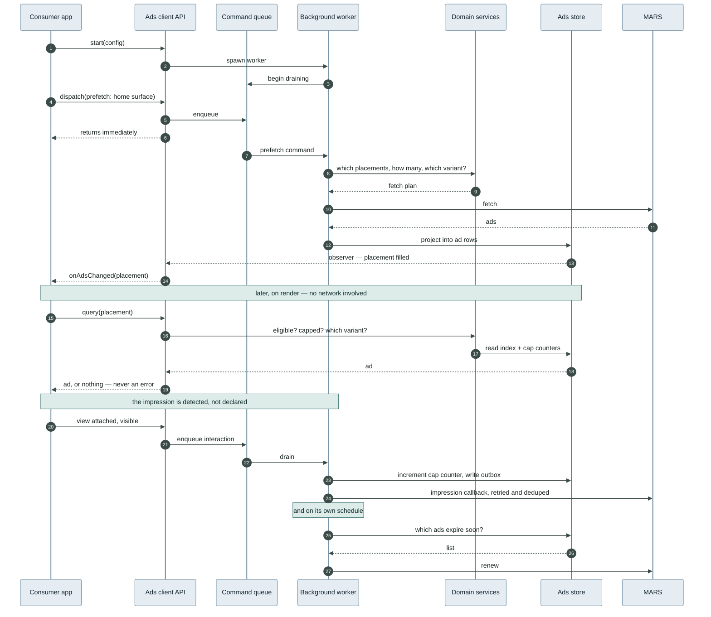

Compared with §1.2, the consumer makes three kinds of call — **start**, **dispatch**,
**query** — none of which blocks on the network, and none of which can fail in a way the
UI has to handle.

---

## 6. What's next — phased

Each phase is independently shippable and independently reversible. The arrows are hard
dependencies, not a wish-ordering.

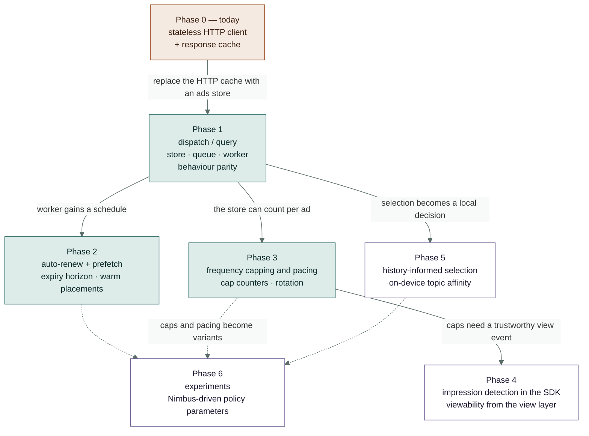

### Phase 1 — dispatch / query, with parity

Land the skeleton with no new behaviour: command API, durable queue, worker thread, ads
store, projection, observer callback. The HTTP cache is deleted; the store replaces it.
The success criterion is boring on purpose — **surfaces render the same ads, and the
consumer deletes its threading and error-handling code.**

*Depends on: nothing. Unlocks: everything.*

### Phase 2 — auto-renew and prefetch

The worker gains a schedule. It refreshes placements before they expire rather than on
demand, and prefetches on lifecycle signals — app foregrounded, surface about to be shown.
First phase where `query()` is expected to be a store hit essentially always.

*Depends on: P1 worker and store.*

### Phase 3 — frequency capping and pacing

Cap counters become first-class store state. The `caps` already arriving on spocs stop
being decoration and start being enforced on device. Rotation across the stored pool comes
for free once selection is local.

*Depends on: P1 per-ad rows. Credibility gated by: P4.*

### Phase 4 — impression detection inside the SDK

Today the consumer decides what an impression is, and every surface decides it slightly
differently. Move the definition inward: the view layer reports raw visibility, the SDK
applies the threshold, writes the outbox, and increments caps. **This is the phase that
makes capping trustworthy** — caps built on inconsistent impression definitions are not caps.

*Depends on: platform visibility signals on iOS and Android.*

### Phase 5 — history-informed selection

With a pool of stored ads and an on-device topic signal, "which of these do we show" becomes
a local decision. Everything stays on device behind the privacy gate; no new signal leaves
the client. **This phase needs privacy review before design, not after.**

*Depends on: P1 local selection, plus privacy sign-off.*

### Phase 6 — experiments

Once policy lives in named services with parameters — horizon, cap window, threshold,
ranking weights — Nimbus can vary them. Experiments become configuration, not forks.

*Depends on: P2, P3 and P5 having tunable parameters.*

### Beyond the numbered phases

- Multi-surface coordination — one pool, several surfaces, no duplicate ads across them.
- Offline-first — dispatch while offline, drain when connectivity returns.
- Server-assisted pacing — MARS hints, client enforces.

---

## 7. Boundaries

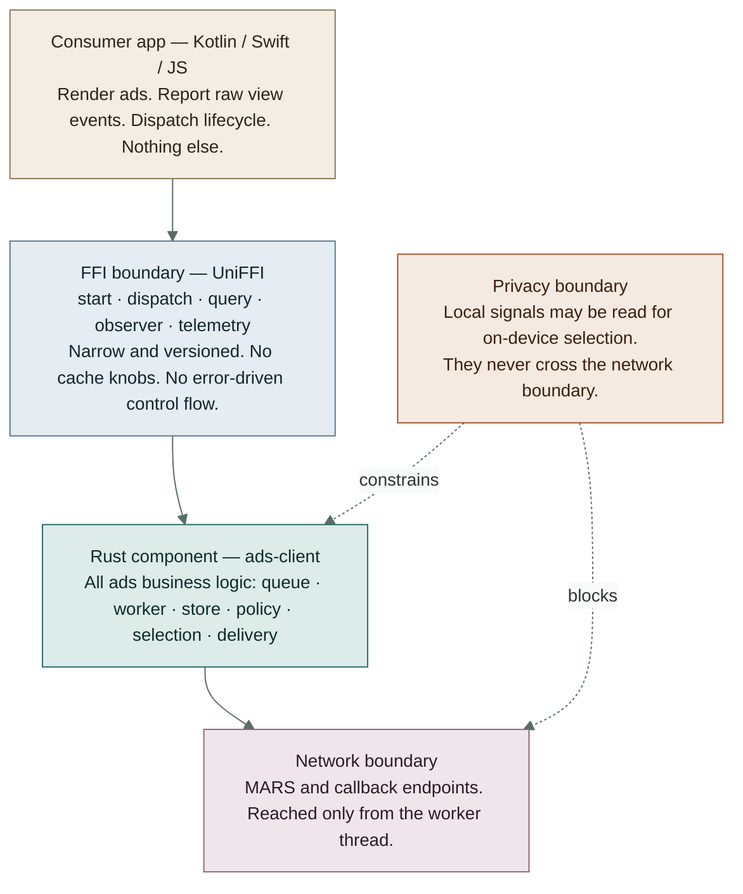

The privacy boundary is not a layer in the stack — it is a constraint that cuts across the
component and hard-stops at the network edge.

### The responsibility ledger

| Concern | Today | V2 |
| --- | --- | --- |
| When ads are fetched | Consumer calls | SDK worker decides |
| Threading | Consumer | One SDK worker thread |
| Errors | Thrown across the FFI | Telemetry only; `query()` returns nothing |
| Retry and offline | Nobody | Queue + outbox with backoff |
| Cache config | Consumer: path, TTL, size | Gone from the public API |
| What is an impression | Each surface, differently | SDK, one definition |
| Frequency capping | Not enforced | SDK |
| Ad rotation | MARS, per request | SDK, over the stored pool |
| Which ad for which slot | MARS | MARS fills the pool, SDK selects from it |
| Experiments | Per-consumer plumbing | Nimbus → SDK policy parameters |

---

## 8. Open questions

These are the decisions that change the diagrams above. They need owners, not consensus.

1. **Threading model across the FFI.** One worker thread inside Rust, or an async runtime?
   What does the consumer do on Desktop, where the JS layer has its own event loop?
2. **Observer versus polling.** Does the UI get a change callback, or does it simply query
   on render? A callback is nicer but adds a foreign-callback lifecycle to manage.
3. **Store durability.** Does the ads store survive process restart, or is it in-memory with
   only the queue and cap counters persisted? Caps must persist; ad rows arguably should not
   outlive their TTL anyway.
4. **`context_id` and the store.** Rotation currently must not invalidate the cache. With
   per-ad rows, what happens to stored ads when the context id rotates?
5. **Impression definition.** What visibility threshold, on which platforms, and can iOS and
   Android both supply the raw signal the SDK needs?
6. **Privacy review scope.** Phase 5 needs sign-off before design work starts. Is a coarse
   on-device topic signal acceptable, and who owns that determination?
7. **Migration.** Do we ship v2 behind a Nimbus flag with the v1 API still present, or cut
   over per surface?
8. **Fill guarantees.** If `query()` can return nothing, what does each surface render in the
   empty state, and is that acceptable to the business?
